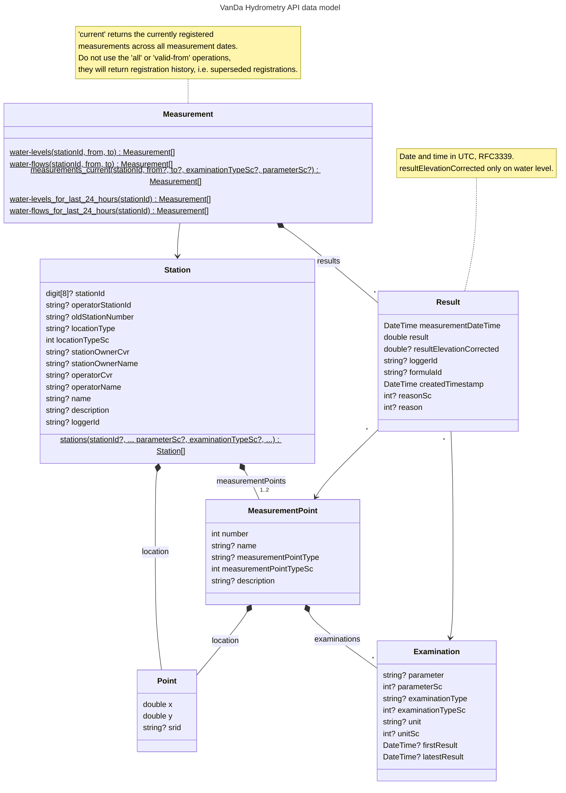

# VanDa Hydrometry API

[VanDa test OpenAPI](https://vandah.test.miljoeportal.dk/api/swagger/index.html)

[VanDa demo OpenAPI](https://vandah.demo.miljoeportal.dk/api/swagger/index.html)
currently no loggers are connected, thus measurements are missing.

[VanDa prod OpenAPI](https://vandah.miljoeportal.dk/api/swagger/index.html)
([local copy of spec](doc/vandah.miljoeportal.dk_api_swagger_v1_swagger.json))

[Further documentation](https://github.com/danmarksmiljoeportal/VanDa/wiki/Hydro-API)

## Data model

### Mapping Between Examination, Parameter, and Unit

StanCodes

| ExaminationType (SC1101)  | Parameter (SC1008) | Unit (SC1009) | Min    | Max    | Decimals |
|---------------------------|--------------------|---------------|--------|--------|----------|
| Elevation Level (21)      | (439)              | m (63)        | -15    | 100    | 3        |
| Scale Pole Level (22)     | Water Level (1233) | cm (19)       | -1.500 | 10.000 | 1        |
| Water Level (25)          | Water Level (1233) | cm (19)       | -1.500 | 10.000 | 1        |
| Water Flow (27)           | Water Flow (1155)  | l/sek (55)    | -      | -      | 1        |
| Measured Water Flow (24)  | Water Flow (1155)  | l/sek (55)    | -      | -      | 1        |
